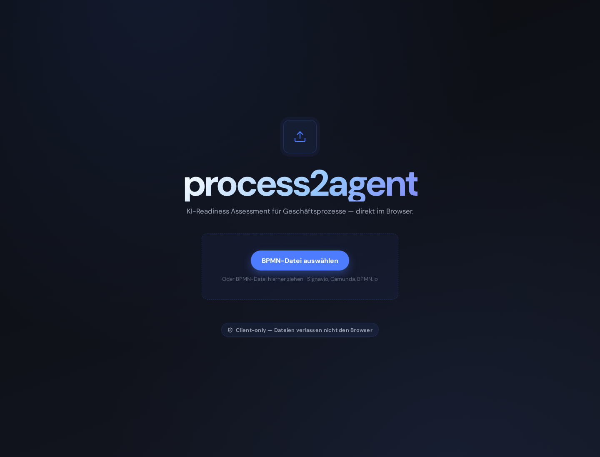
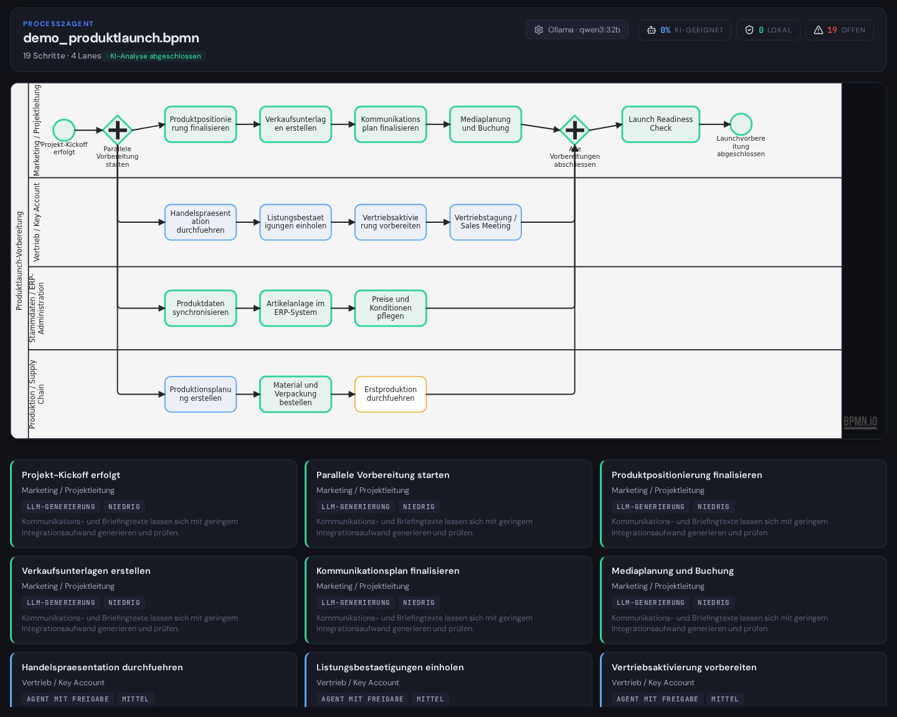
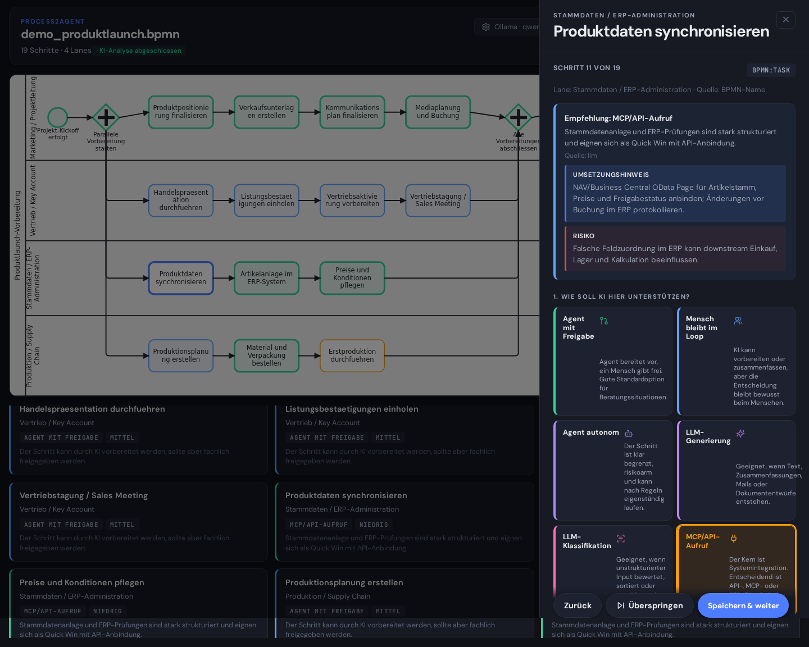
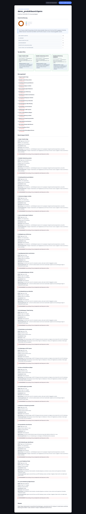

# process2agent

**AI-Readiness Assessment for Business Processes**

Import a BPMN process model. Get an instant, LLM-powered analysis of which steps are ready for AI automation, which need human oversight, and where data privacy requires local processing.


---

## What It Does

process2agent takes a standard `.bpmn` file and answers one question: *Where in this process does AI actually make sense?*

1. **Import** a BPMN file exported from Signavio, Camunda, or any BPMN 2.0 tool
2. **Analyze** every process step using LLM-powered batch analysis (Anthropic Claude or local Ollama) with rule-based fallback
3. **Review** the pre-filled assessment: each step gets a suggested automation pattern, privacy classification, complexity rating, and concrete implementation hints
4. **Export** a printable AI-Readiness Report with executive summary, per-step breakdown, and a prioritized list of quick wins

The entire workflow runs client-side. No BPMN data leaves your browser unless you explicitly connect an LLM provider.

---

## Key Features

**LLM-Powered Batch Analysis**
A single API call analyzes all process steps at once, considering element names, BPMN documentation fields, lane assignments, and process flow. The result: pre-filled assessments with rationale, implementation hints, and risk flags. No manual form-filling required.

**Privacy-Aware Routing**
Each step gets a privacy classification (PII confirmed / likely / pseudonymized / no PII / unknown). Steps with personal data are flagged for local processing. The assessment documents human decisions, not automated guesses, producing a compliance-ready artifact.

**Quick Wins Prioritization**
After analysis, steps are grouped into three categories: Quick Wins (high potential, low complexity), Automation Potential (medium effort), and Stays Human (deliberate human oversight). This is the view a CTO understands in a 15-minute meeting.

**ERP-Aware Suggestions**
Built-in domain knowledge for NAV/Business Central processes (Purchase-to-Pay, Order-to-Cash, master data management). The keyword engine recognizes ERP-specific terminology and suggests appropriate integration patterns (OData API, Web Services, MCP).

**Rule-Based Fallback**
When no LLM is configured or the API call fails, the app falls back to a two-stage rule engine: BPMN element type mapping (Stage 1) and domain keyword matching (Stage 2). Every feature works offline.

---

## Screenshots

### Import View

*Drag and drop a .bpmn file or select the demo process*

### Assessment with Color-Coded BPMN

*Green: Quick Wins / Blue: Automation Potential / Amber: Human in the Loop*

### Interview Drawer

*LLM-generated recommendation with implementation hint and risk assessment*

### AI-Readiness Report

*Printable report with donut chart, quick wins, and per-step analysis*

---

## Quick Start

```bash
git clone https://github.com/yourusername/process2agent.git
cd process2agent
npm install
npm run dev
```

Open `http://localhost:5173` and drop a `.bpmn` file.

### LLM Configuration

Click the gear icon in the header to configure an LLM provider:

- **Anthropic API**: Enter your API key. Uses `claude-sonnet-4-6` for batch analysis.
- **Ollama (local)**: Point to your Ollama instance (default: `http://localhost:11434`). Recommended model: `qwen3:32b` or larger.
- **None**: Rule-based analysis only. No API calls, fully offline.

---

## Tech Stack

| Component | Technology |
|---|---|
| Framework | React 19 + TypeScript |
| Build | Vite 6 |
| BPMN Rendering | bpmn-js (Camunda, MIT) |
| BPMN Parsing | Native DOMParser + custom normalization |
| Styling | Custom CSS (dark theme, no framework) |
| LLM Integration | Anthropic Messages API / Ollama REST API |
| Report Export | Browser print / PDF via `window.print()` |
| Icons | Lucide React |

---

## Architecture

```
.bpmn file
    |
    v
[BPMN Parser] ─── extracts elements, lanes, documentation
    |
    v
[Domain Enrichment] ─── rule-based mapping (BPMN type + keywords)
    |
    v
[LLM Service] ─── optional: batch analysis via Anthropic/Ollama
    |                sends all steps as structured prompt
    |                returns: pattern, privacy, complexity,
    |                rationale, implementation_hint, risk, quick_win
    v
[Assessment State] ─── useReducer with decisions per element
    |
    v
[UI] ─── BPMN Viewer (color-coded) + Element Grid + Drawer + Report
```

### The Mapping Table

The core intellectual contribution is a systematic mapping from BPMN element types to agentic workflow patterns:

| BPMN Element | Default Pattern | Rationale |
|---|---|---|
| User Task | Human in the Loop | Human decisions stay human by default |
| Service Task | MCP/API Call | System integration depends on target API |
| Script Task | Local Code Execution | Deterministic logic, no LLM needed |
| Manual Task | Notify and Wait | Physical/external activity |
| Exclusive Gateway | Needs Clarification | Rule-based or judgment-based? Must be documented |
| Parallel Gateway | Rule-Based Automation | Orchestration pattern, no LLM needed |

This mapping is refined by domain-specific keyword matching (NAV/BC patterns for P2P, O2C, invoice processing) and optionally by LLM-powered semantic analysis.

Full mapping table: [docs/MAPPING_TABLE.md](docs/MAPPING_TABLE.md)

---

## Demo Process

The repository includes `demo_produktlaunch.bpmn`, a product launch preparation process with 4 parallel lanes (Marketing, Sales, ERP Administration, Production/Supply Chain) and 19 process steps. Use it to explore the assessment workflow without your own BPMN files.

---

## Privacy

- **Client-only by default**: BPMN files are parsed in the browser. No upload, no server, no tracking.
- **LLM is opt-in**: The app works fully offline with rule-based analysis. LLM calls only happen when you configure a provider.
- **When LLM is active**: Only element names, BPMN types, lane names, and documentation text are sent. No raw XML, no file content.
- **Privacy decisions are human**: The app asks you to classify data sensitivity per step. It documents your decision, not an automated guess.

---

## Limitations

- **v1 scope**: Generic BPMN tasks (not specialized UserTask/ServiceTask subtypes) are common in Signavio exports. The engine handles them but gives less specific suggestions.
- **No subprocess resolution**: Embedded subprocesses are flagged as "needs clarification" rather than recursively analyzed.
- **Template matching is keyword-based**: The domain enrichment works best for German-language BPMN models in the ERP/supply chain domain.
- **LLM quality varies**: Local models (7B-14B) produce less specific implementation hints than Claude Sonnet. For best results, use Anthropic API or a 32B+ local model.

---

## Roadmap

- [ ] YAML configuration export for agentic workflow frameworks
- [ ] Additional process templates (Order-to-Cash, Customer Onboarding)
- [ ] English UI localization
- [ ] LLM-powered GDPR interview (legal basis, data categories, retention periods)
- [ ] Vercel/Netlify deployment for public demo

---

## Background

This project bridges two domains that rarely intersect: **BPMN process modeling** (Signavio, Camunda, ARIS) and **AI agent orchestration** (LLM routing, MCP integration, privacy-aware hybrid inference). It grew from the observation that companies have thousands of documented processes but no systematic way to assess where AI agents add value.

The mapping table, the privacy-routing methodology, and the ERP-specific domain patterns are the result of hands-on experience in both process management (NAV/BC, Demand-to-Market, Purchase-to-Pay) and multi-provider LLM architecture.

---

## License

MIT
