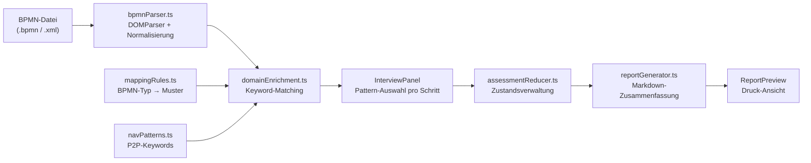

# process2agent

> AI-Readiness Assessment fuer Geschaeftsprozesse — direkt im Browser, ohne Backend.

Du laedt eine BPMN-Datei aus Signavio oder Camunda Modeler. Die App erkennt jeden Prozessschritt automatisch und schlaegt vor, welches KI-Agenten-Muster passt (z.B. "Agent mit Freigabe" oder "Mensch bleibt im Loop"). Das Ergebnis ist ein druckbarer AI-Readiness-Report — kein Upload, keine Cloud, alles lokal.

---

## Was es tut

| Schritt | Was passiert |
|---------|-------------|
| 1. BPMN importieren | Drag & Drop einer `.bpmn`-Datei aus Signavio, Camunda oder BPMN.io |
| 2. Automatische Analyse | Jeder Prozessschritt wird per Keyword-Matching und BPMN-Typ einem KI-Muster zugeordnet |
| 3. Gefuehrtes Interview | Der Nutzer bestaetigt oder korrigiert den Vorschlag pro Schritt (Pattern, Datenschutz, Komplexitaet) |
| 4. Report generieren | Druckbarer AI-Readiness-Report mit Zusammenfassung und Klaerungsbedarfen |

---

## Screenshot

<!-- TODO: Screenshot nach Deployment einfuegen -->
*Demo folgt nach Deployment auf Vercel/Netlify.*

---

## Tech-Stack

| Layer | Technologie |
|-------|-------------|
| Framework | React 19 + TypeScript (strict) |
| BPMN-Rendering | [bpmn-js](https://github.com/bpmn-io/bpmn-js) (Camunda, MIT) |
| BPMN-Parsing | Browser `DOMParser` — kein SDK, kein Backend |
| Styling | Custom CSS (plain, kein Tailwind) |
| Build | Vite 6 |
| State | React Context + `useReducer` |
| PDF-Export | `window.print()` + `@media print` |
| Hosting | Static Site (Vercel / Netlify) |

---

## Lokale Installation

```bash
git clone https://github.com/<your-username>/process2agent.git
cd process2agent
npm install
npm run dev
# Oeffnet http://localhost:5173
```

Einzige Voraussetzung: Node.js >= 18. Kein Backend, kein API-Key, kein Konto.

---

## Architektur



### Kernprinzipien

- **Client-Only:** Keine BPMN-Datei verlaesst den Browser. Kein Upload-Endpoint, kein Tracking.
- **LLM-Optional:** Die App laeuft vollstaendig regelbasiert. Ein LLM (Ollama, Anthropic) ist v2-Scope.
- **Mensch entscheidet:** Das System schlaegt vor, der Nutzer bestaetigt. Jede Entscheidung wird im Report dokumentiert.
- **Conservative Defaults:** Im Zweifel "Agent mit Freigabe" statt "Agent autonom". Vertrauen vor Geschwindigkeit.

---

## Mapping-Tabelle

Die zentrale Zuordnung von BPMN-Typen zu KI-Agenten-Mustern ist in [`MAPPING_TABLE.md`](MAPPING_TABLE.md) dokumentiert — als eigenstaendiges, zitierbares Dokument unabhaengig von der App.

---

## Lizenz

MIT — siehe [LICENSE](LICENSE).
